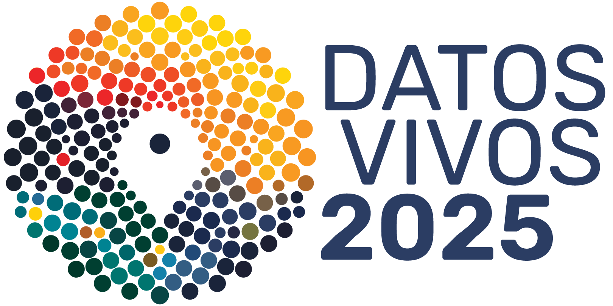
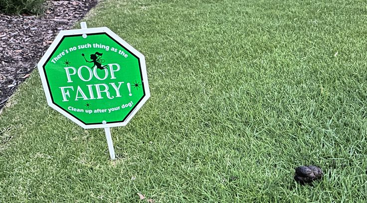
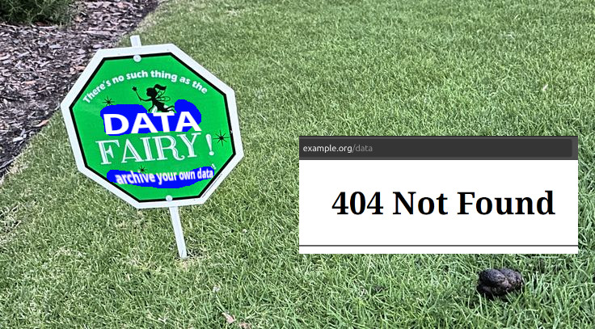
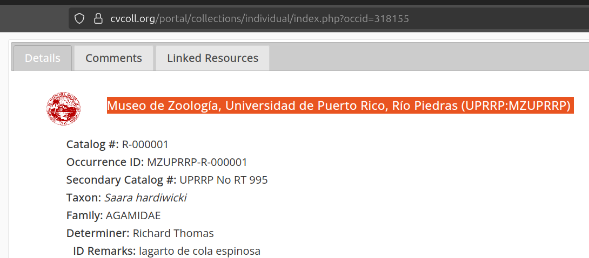

---
author:
 - Jorrit H. Poelen
 - Katja C. Seltmann
title: "Book Binding for the Digital Age"
subtitle: |-
  Format Agnostic Method to Review and Archive Biodiversity Data
abstract: While traditional books offer stable, citable, and independently archived units of knowledge, digital data often lack these qualities. Books maintain consistent content over time, and bookbinding ensures content integrity because it is evident if a page has been torn out. In contrast, digital content on the web is ephemeral, susceptible to modification or loss without clear mechanisms for tracking what was changed. Here, we present a framework for treating biodiversity datasets as \"digitally bound books\" immutable, read-only data packages that can be archived, verified, cited, and grouped into collections without altering their content or structure. This approach provides a durable and decentralized model for data stewardship, enabling biodiversity knowledge to be preserved, discovered, collected, shared and cherished much like traditional books. Built on flexible and mature NIST and W3C standards, these \"digitally bound books\" or data packages, support rich provenance and exact content referencing. A data package can consist of single data records, entire datasets (a Darwin Core Archive), data portals, as well as larger collections of biodiversity data (GBIF & iDigBio datasets, BHL pdfs). We show how our framework allows for packaging of heterogeneous data sources by applying it to three examples (1) single specimen image, (2) darwin core archivefrom a natural history collection including associated images, and (3) packaging entire networks. We then demonstrate digitally binding these examples and depositing them to Zenodo, creating sharable and citiable versions of the datasets for QC review (taxon name alignment) and analysis. With these examples, we hope to demonstrate that this framework supports any data format and allows for packaging, citing and distributing these digital data similar to how books are bound, referenced and distributed. These digitally bound datasets are ready to be cited in published literature, and enable trustworthy, decentralized biodiversity data stewardship at multiple scales. 

date: 2025-10-23
aspectratio: 169
---

Presented as part of the Datos Vivos conference in Bogotá, Colombia 21-24 Oct 2025.



---

### Cite As

Poelen, J.H.; Seltmann, K.C. (2025) Book Binding for the Digital Age. Zenodo. [https://doi.org/10.5281/zenodo.17352156](https://doi.org/10.5281/zenodo.17352156)

### License

CC BY 4.0. For license text, see [https://creativecommons.org/licenses/by/4.0/](https://creativecommons.org/licenses/by/4.0/). 


---

## Digital Data on the Internet are Ephemeral

> [...] We began in 1996 by archiving the Internet itself, a medium that was just beginning to grow in use. Like newspapers, the content published on the web was ephemeral - but unlike newspapers, no one was saving it. [...] ^[Internet Archive. 2025. Accessed on 2025-10-13 at https://archive.org/about]

## Digital **Biodiversity** Data on the Internet are Ephemeral

> [...] 20%-75% of biodiversity datasets in data networks GBIF, iDigBio, DataONE, and BHL changed or were unavailable in 2019/2020.[...] ^[Elliott et al. 2020. Ecol Inf. [doi:10.1016/j.ecoinf.2020.101132](https://doi.org/10.1016/j.ecoinf.2020.101132)]

## Who or what keeps our Digital Biodiversity Data around? 

a) **the Data Fairy.**

b) Awareness of the fragility of digital data. 

d) Common sense data archiving and citation practices.

## Who or what keeps our Digital Biodiversity Data around? 

a) **the Data Fairy.**

> Who is this Data Fairy?

b) Awareness of the fragility of digital data. 

d) Common sense data archiving and citation practices.

## Is GBIF our Data Fairy?

GBIF Secretariat provides a publication **framework** for biodiversity data, but **is neither the owner nor custodian of such data**, and therefore is not responsible for the actual content served by Data Publishers.

GBIF Secretariat cannot guarantee the quality or completeness of data, **nor does it guarantee uninterrupted data access services**. Users employ these data and services at their own risk. ^[https://www.gbif.org/terms/data-user as accessed on 2025-10-13].

## Is GBIF our Data Fairy?

GBIF Secretariat provides a publication **framework** for biodiversity data, but **is neither the owner nor custodian of such data**, and therefore is not responsible for the actual content served by Data Publishers.

GBIF Secretariat cannot guarantee the quality or completeness of data, **nor does it guarantee uninterrupted data access services**. Users employ these data and services at their own risk. ^[https://www.gbif.org/terms/data-user as accessed on 2025-10-13].

### No! 

### **GBIF is not claiming to be a data fairy who keeps your digital archives.** 


## Data Fairy is a Cousin of the Poop Fairy. 



## Data Fairy is a Cousin of the Poop Fairy. 



## Recent Reminders of Data Fairy Absence

 * Symbiota server infrastructure running the Symbiota Hosted Portals at Arizona State University (ASU) were compromised and taken offline 21 Jul 2025 and was said to be fully restored on 10 Oct 2025 after hard work by the Symbiota Support Hub team. The outage affected over 54 hosted collections. 
 * The Symbiota Collections of Arthropods Network (**SCAN: https://scan-bugs.org**) serving specimen occurrence records and images from over 100 North American arthropod collections for all arthropod taxa, was taken offline in 2025 with no plans to revive it.
 * 20 years since its inception and facilitating access to over 300k digitized biodiversity data works, the **Biodiversity Heritage Library** faces an uncertain future as it is set to lose their institutional sponsor, the Smithsonian, on 1 Jan 2026 ^[https://about.biodiversitylibrary.org/about/future-of-bhl/].  


## Who or what keeps our Digital Biodiversity Data around? 

a) ~~the Data Fairy~~

b) **Awareness of the fragility of digital data.**

c) Common sense data archiving and citation practices.

## Who or what keeps our Digital Biodiversity Data around? 

a) ~~the Data Fairy~~

b) Awareness of the fragility of digital data.

c) **Common sense data archiving and citation practices.**

## Book Binding for Digital Biodiversity Data 
 
 * What is so neat about physical books? 

 * What is book binding for biodiversity data? 

 * Example 1: The iDigBio Archives
 
 * Example 2: Plazi's BHL Corpus 

 * Example 3: GloBI's Archive and Review of SCAN

## The Neat Thing about Physical Books

Even before the invention of the book press, books and scrolls have been pretty successful in transferring knowledge across generations and around the world. 

Typically, books are portable stacks of bound paper containing text and imagery.

Books can combined into collections without changing their design. 

Books are kept around the world in (little) public libraries, academic institutions, private collections and national archives.

Books are wireless, their content cannot be easily altered remotely, changes can be detected (ripped out pages), and they need no power to operate.

Books can be sent by physical mail.

## The Neat Thing about Physical Books

Even before the invention of the book press, books and scrolls have been pretty successful in transferring knowledge across generations and around the world. 

Typically, books are portable stacks of bound paper containing text and imagery.

Books can combined into collections without changing their design. 

Books are kept around the world in (little) public libraries, academic institutions, private collections and national archives.

Books are wireless, their content cannot be easily altered remotely, changes can be detected (ripped out pages), and they need no power to operate.

Books can be sent by physical mail.

### Idea ...  what if we treat digital data more like a bound book instead of a web location?

## Steps to Binding Digital Data Books

Step 1. Use **signed** citations to reference digital data ^[Elliott et al. 2023. Sci Data. [doi:10.1038/s41597-023-02230-y](https://doi.org/10.1038/s41597-023-02230-y)].

Step 2. Bind these referenced data by describing them in a **Data Bill of Materials** (DataBoM). 

Step 3. Publish the data bill of materials, a digital text file.

Step 4. Use the signed citation of the data bill of material (DataBoM) in your research. 

Step 5. Continuously monitor the availability of the DataBoM and the associated data.

## Example 1: DataBoM for iDigBio Data Registry

Create an iDigBio Data Bill of Materials by capturing their registered datasets, and describing their origins, 

```
(iDigBio Registry with Institutional DwC-A Data URLs) 
  -[:take snapshot and download DwC-As]
     ->(DataBoM + DwC-A files) 
``` 

using the following Preston ^[https://github.com/bio-guoda/preston] command 

```
preston track --seed https://idigbio.org
```

## Data Bill of Material (DataBoM) in English

Expressing the digital content and their origin of the DataBoM in "plain" English:

*"A version of the iDigBio registry was downloaded on 2025-10-01 from <...idigbio.org/v2/search...> with content signature <hash://sha256/52d6...>. This iDigBio registry version had member dataset <urn:uuid:650...> associated with <.../UCSB-IZC_DwC-A.zip> . And this DwC-A URL had content signature <hash://sha256/3d4e...> as seen on 2025-10-01."*

## Data Bill of Material (DataBoM) in rdf/nquads

or, made more machine readable using Provenance Ontology ^[https://www.w3.org/TR/prov-o/] and Hash URIs ^[Elliot et al. 2023. Sci Data. [doi:10.1038/s41597-023-02230-y](https://doi.org/10.1038/s41597-023-02230-y)] as expressed in rdf/nquads:

```
<...idigbio.org/v2/search...> 
  <hasVersion> 
    <hash://sha256/52d6...> .
<hash://sha256/52d6...> 
  <hadMember> 
    <urn:uuid:650...> .
<urn:uuid:650...> 
  <hadMember> 
    <.../UCSB-IZC_DwC-A.zip> .
<.../UCSB-IZC_DwC-A.zip> 
  <hasVersion> 
    <hash://sha256/3d4e...> .
```

## DataBoM Binds Data Together

As a text file, the DataBoM has a content signature that uniquely identifies the digital bound collection of signed data it references.

So, retrieval method for data bundle defined by DataBoM with signature X is:

1. get the DataBoM by their signature X.
3. get data listed in DataBoM by their signatures.

Note that we are asking for the data content, not the data location. Also, content signatures are format agnostic, so any content (of any size) can be included.

## DataBoM Binds Data Together


Here's a retrieval method for the first DwC record in the data bundle defined by DataBoM with a sha256 signature starting with 40c4... as **expressed in a bash script**.

```
preston cat\
 --remote https://linker.bio\
 hash://sha256/40c44d75d243e\
8d1fde2376483637df6f96bfe182\
bb4bcd119cb5311cfdbc000\
 | preston dwc-stream\
  --remote https://linker.bio\
 | head -1
```

producing the first record as _Saara hardiwicki_,  a lizard specimen from Pakistan from Museo de Zoología, Universidad de Puerto Rico, Río Piedras (UPRRP:MZUPRRP).

## We found a lizard specimen from Pakistan in a Puerto Rican Collection!



## Extra Credit: Finding the Last Record

### What bash script would find the last DwC record associated with this DataBoM ? 

 * Hint: lizards have one, but humans don't.

## Extra Credit: Finding the Last Record

```
preston cat\
 --remote https://linker.bio\
 hash://sha256/40c44d75d243e\
8d1fde2376483637df6f96bfe182\
bb4bcd119cb5311cfdbc000\
 | preston dwc-stream\
  --remote https://linker.bio\
 | tail -1
```

... associates with an occurrence of fungus _Absidia corymbifera_ .

## DataBoM Flexibility

Data Bill of Materials (DataBoMs)

1. ... can reference other DataBoMs, including older versions of a DataBoM.
2. ... can be tiny or super huge
3. ... allow for arbitrarily detailed description of data provenance in natural language or using structured text like rdf/nquads in combation with the provenance ontology.

With this, DataBoMs are a recursive data structure allowed to grow to arbitrary size. 

## Examples 2. and 3. — More Existing DataBoMs

### >300k Digitized Biodiversity Heritage Literature Items
Poelen, J. H., & Agosti, D. (2025). A Versioned Literature Corpus derived from Biodiversity Heritage Library hash://md5/b3cd9de0685deeebf57a5d225e59c10f (0.3) [Data set]. Zenodo. https://doi.org/10.5281/zenodo.16616872

### Darwin Core Archives Associated with scan-bugs.org
Elton, Nomer, & Preston. (2025). Versioned Archive and Review of Biotic Interactions and Taxon Names Found within globalbioticinteractions/scan hash://md5/58de50154e330c331993fe5d0852ad84. Zenodo. https://doi.org/10.5281/zenodo.16894884

## Who or what keeps our Digital Biodiversity Data around? 

a) ~~the Data Fairy~~

b) **Awareness of the fragility of digital data.**

c) **Common sense data archiving and citation practices.**


## How to keep our Digital Biodiversity Data around? 

I've been using this Data Bill of Materials approach to track terrabytes of biodiversity data since Sept 2018, keeping identical copies across independent storage locations, and reusing their content.

### How do *you* intend keep our digital heritage around? 

## And Remember


## Thank you!

Made possible (in part) by NSF's [DBI 2027654](https://www.nsf.gov/awardsearch/showAward?AWD_ID=2027654), [DBI 2102006](https://www.nsf.gov/awardsearch/showAward?AWD_ID=2102006) and [OAC 1839201](https://www.nsf.gov/awardsearch/showAward?AWD_ID=1839201).

For questions/comments/ideas, please do reach out to:

**Jorrit H. Poelen**

[https://jhpoelen.nl](https://jhpoelen.nl) 

[jhpoelen@jhpoelen.nl](mailto:jhpoelen@jhpoelen.nl)

[https://orcid.org/0000-0003-3138-4118](https://orcid.org/0000-0003-3138-4118)


